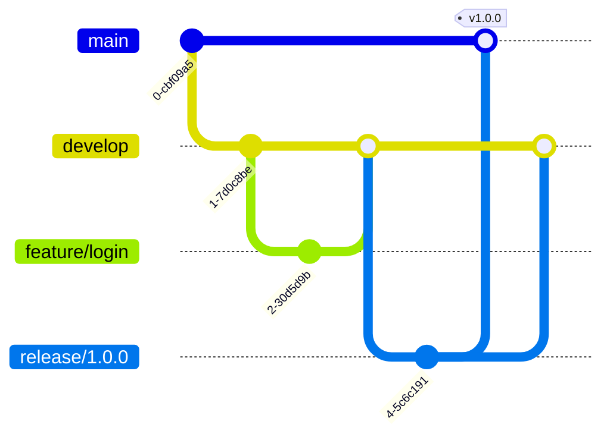

# GitFlow Strategy

This document defines the **Git branching and collaboration strategy** used on both **backend** and **frontend** repositories.

The goal is to provide:
- A stable production branch
- A shared integration branch
- Predictable and controlled releases
- Consistent workflows across teams

---

## Overview of GitFlow

GitFlow is a branching model that separates **development**, **stabilization**, and **production** concerns using well-defined branch roles.
V
At a high level:

- `main` represents **production-ready code**
- `develop` represents the **latest integrated development state**
- All feature and fix work is done in short-lived branches
- Changes are promoted toward `main` in a controlled manner

---

## Long-Lived Branches

### `main`

**Purpose**
- Represents the production-ready state of the application
- Always deployable

**Rules**
- Protected branch
- No direct commits
- Changes only via Pull Requests from `release/*` or `hotfix/*`
- Must pass all CI checks
- Requires code review

Both backend and frontend repositories use `main` as the **production source of truth**.

---

### `develop`

**Purpose**
- Integration branch for ongoing development
- Contains the latest completed features ready for the next release

**Rules**
- Protected branch
- No direct commits
- Changes only via Pull Requests
- Must remain in a deployable state for non-production environments

Both backend and frontend repositories use `develop` as the **default branch** for development.

---

## Short-Lived Branches

### `feature/*`

**Purpose**
- Development of new features or significant enhancements

**Naming**
`feature/<short-description>`

**Examples**
- `feature/authentication`
- `feature/task-management`
- `feature/dashboard-ui`

**Rules**
- Created from `develop`
- Merged back into `develop` via Pull Request
- Deleted after merge

**Backend usage**
- New use cases
- Domain logic extensions
- New adapters or API endpoints

**Frontend usage**
- New pages or workflows
- New UI components
- New API integrations

---

### `fix/*`

**Purpose**
- Bug fixes identified during development (non-production)

**Naming**
`fix/<short-description>`

**Examples**
- `fix/task-validation`
- `fix/login-error`

**Rules**
- Created from `develop`
- Merged back into `develop`
- Must include tests when applicable

Used identically in backend and frontend repositories.

---

### `release/*`

**Purpose**
- Stabilization of a release before production

**Naming**
`release/<version>`

**Examples**
- `release/1.0.0`
- `release/1.1.0`

**Rules**
- Created from `develop`
- Only bug fixes, documentation, and release metadata allowed
- No new features
- Merged into:
  - `main` (for production)
  - `develop` (to keep branches in sync)
- Tagged on `main` after merge

Both backend and frontend must use matching release versions when applicable.

---

### `hotfix/*`

**Purpose**
- Critical fixes for production issues

**Naming**
`hotfix/<short-description>`

**Examples**
- `hotfix/auth-token-expiry`
- `hotfix/startup-failure`

**Rules**
- Created from `main`
- Merged into:
  - `main`
  - `develop`
- Tagged on `main` after merge

Hotfixes must be minimal and focused.

---

### `chore/*`

**Purpose**
- Non-functional changes

**Examples**
- Build configuration
- Dependency updates
- Refactoring without behavior change
- Documentation updates

**Naming**
`chore/<short-description>`

**Rules**
- Created from `develop`
- Merged into `develop`

---

## Pull Request Workflow

All changes must go through a Pull Request.

### Required Steps

1. Create a branch from the appropriate base (`develop` or `main`)
2. Commit changes using **Conventional Commits**
3. Open a Pull Request to the target branch
4. Ensure all CI checks pass
5. Obtain required approvals
6. Merge using the approved merge strategy

---

## Merge Strategy

### Squash Merge (Preferred)

- Default strategy for `feature/*`, `fix/*`, and `chore/*`
- Keeps history clean and readable
- Squash commit messages must follow **Conventional Commits**

### Merge Commit (Allowed)

- Used for `release/*` and `hotfix/*`
- Preserves branch history for traceability

---

## Backend and Frontend Alignment

The backend and frontend repositories follow **the same GitFlow rules**:

- Same branch names
- Same promotion path (`develop` → `release` → `main`)
- Same merge and review requirements

This ensures consistent collaboration and release coordination.

---

## Forbidden Practices

- Direct commits to `main` or `develop`
- Merging without Pull Requests
- Introducing features in `release/*` branches
- Skipping CI checks
- Long-lived feature branches

---

## Summary

- `main` is production
- `develop` is integration
- Features and fixes branch from `develop`
- Releases are stabilized in `release/*`
- Hotfixes branch from `main`
- Backend and frontend follow the same workflow

This GitFlow strategy provides structure, safety, and scalability for the Fundamentalis project.